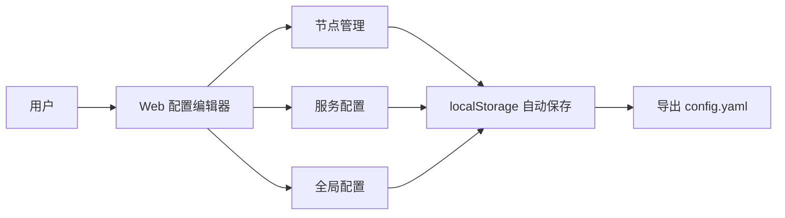

# 大数据平台离线配置生成器 - 使用指南

## 架构概览

```
┌─────────────────────────────────────────────────────────────────────────┐
│                         配置生成架构                                     │
├─────────────────────────────────────────────────────────────────────────┤
│                                                                          │
│  ┌──────────────────────────────────────┐                              │
│  │         Go 后端服务 (端口 5000)        │                              │
│  │                                       │                              │
│  │  ┌─────────────┐  ┌────────────────┐ │                              │
│  │  │  REST API   │  │  模板渲染引擎   │ │                              │
│  │  │  /api/*     │  │  Go Template   │ │                              │
│  │  └──────┬──────┘  └────────────────┘ │                              │
│  │         │                             │                              │
│  │  ┌──────▼──────────────────────────┐  │                              │
│  │  │  config.yaml  ◄──►  output/     │  │                              │
│  │  │  templates/                      │  │                              │
│  │  └─────────────────────────────────┘  │                              │
│  │                                       │                              │
│  │  ┌─────────────────────────────────┐  │                              │
│  │  │  前端静态文件托管 (web/dist)     │  │                              │
│  │  └─────────────────────────────────┘  │                              │
│  └──────────────────────────────────────┘                              │
│                                                                          │
│  ┌──────────────────────────────────────┐                              │
│  │         React 前端 (Web 编辑器)        │                              │
│  │                                       │                              │
│  │  • 节点管理      • 服务配置           │                              │
│  │  • 全局配置      • YAML 预览          │                              │
│  │  • 生成配置      • 导出下载           │                              │
│  └──────────────────────────────────────┘                              │
│                                                                          │
└─────────────────────────────────────────────────────────────────────────┘
```

## 两种使用方式

### 方式一：Web 配置界面（推荐）

通过 Web 界面可视化配置，点击按钮生成部署脚本。

### 方式二：命令行模式

直接编辑 `config.yaml` 文件，运行 Go 程序生成部署脚本。

## 快速开始

### 1. 启动服务

```bash
# 开发环境
cd web && pnpm install && pnpm run build
cd ../server && go run main.go

# 或使用 .coze 配置
coze dev
```

### 2. 访问 Web 界面

打开浏览器访问 http://localhost:5000

### 3. 配置集群

在 Web 界面完成以下步骤：

1. **全局配置** - 设置用户、目录、Java 路径等
2. **节点管理** - 添加集群节点（IP、主机名）
3. **服务配置** - 配置服务拓扑和参数
4. **生成配置** - 点击按钮生成部署脚本
5. **导出下载** - 下载生成的配置包

## API 接口

| 接口 | 方法 | 说明 |
|------|------|------|
| `/api/config` | GET | 获取当前配置 |
| `/api/config` | PUT | 保存配置 |
| `/api/generate` | POST | 生成部署脚本 |
| `/api/output` | GET | 获取生成的文件列表 |
| `/api/output/download` | GET | 下载配置包 (zip) |
| `/api/config/reload` | POST | 从文件重新加载配置 |

### 3. 配置模板（Templates）

**路径**: `templates/`

**结构**:
```
templates/
├── doris/
│   ├── fe/              # Doris FE 模板
│   │   ├── install_fe.sh.tmpl
│   │   └── start_fe.sh.tmpl
│   ├── be/              # Doris BE 模板
│   │   ├── install_be.sh.tmpl
│   │   ├── start_be.sh.tmpl
│   │   └── add_be.sh.tmpl
│   ├── system_init.sh.tmpl
│   ├── init_db.sh.tmpl
│   └── README.md.tmpl
├── hadoop3/             # Hadoop 3 模板
├── zookeeper/           # ZooKeeper 模板
└── ...
```

## 快速开始

### 方式一：使用 Web 配置编辑器（推荐）

#### 1. 安装依赖

```bash
# 安装 Go 1.21（如果尚未安装）
wget https://studygolang.com/dl/golang/go1.21.13.linux-amd64.tar.gz -O /tmp/go.tar.gz
sudo tar -xzf /tmp/go.tar.gz -C /usr/local
export PATH=$PATH:/usr/local/go/bin

# 验证安装
go version
```

#### 2. 启动 Web 编辑器

```bash
cd web

# 安装前端依赖
pnpm install

# 启动开发服务器
pnpm dev
```

访问 http://localhost:5000 打开编辑器。

#### 3. 配置集群

在 Web 编辑器中完成以下配置：

**步骤 1: 全局配置**
- 设置运行用户（如 `bigdata`）
- 设置安装目录（如 `/data/localization`）
- 设置 JAVA_HOME（如 `/data/jdk`）

**步骤 2: 添加节点**
- 节点名称: `dw-master1`
- IP 地址: `192.168.10.10`
- 主机名: `dw-master1`

**步骤 3: 配置服务拓扑**
- 添加 Doris FE: 选择 `dw-master1`
- 添加 Doris BE: 选择所有数据节点

**步骤 4: 导出配置**
- 进入「导出配置」页面
- 下载 `config.yaml`
- 将文件保存到项目根目录

#### 4. 生成部署脚本

```bash
# 在项目根目录执行
cd ..

# 下载 Go 依赖
export GOPROXY=https://goproxy.cn,direct
go mod tidy

# 生成配置
go run main.go
```

生成的部署脚本位于 `output/` 目录：
```
output/
├── 192.168.10.10/
│   ├── doris/
│   │   ├── fe/
│   │   │   ├── install_fe.sh
│   │   │   └── start_fe.sh
│   │   └── be/
│   │       ├── install_be.sh
│   │       ├── start_be.sh
│   │       └── add_be.sh
│   └── ...
└── ...
```

### 方式二：手动编辑 YAML

#### 1. 编辑 config.yaml

```bash
vim config.yaml
```

#### 2. 关键配置示例

```yaml
# 全局配置
global:
  user: "bigdata"
  group: "bigdata"
  install_base_dir: "/data/localization"
  data_base_dir: "/data"
  java_home: "/data/jdk"

# 节点配置
nodes:
  dw-master1:
    ip: "192.168.10.10"
    hostname: "dw-master1"
  dw-worker1:
    ip: "192.168.10.13"
    hostname: "dw-worker1"

# 服务拓扑
serviceTop:
  doris/fe:
    nodes: [dw-master1]
    vars:
      version: "2.0.3"
      http_port: 8030
  
  doris/be:
    nodes: [dw-master1, dw-worker1]
    vars:
      version: "2.0.3"
      be_port: 9060
```

#### 3. 生成部署脚本

```bash
go run main.go
```

## 工作流程详解

### 阶段 1: 配置编辑（Web 前端）



### 阶段 2: 配置生成（Go 后端）


### 阶段 3: 部署执行


## 模板变量说明

### 全局变量

在模板中使用 `{{.Global.xxx}}` 访问：

| 变量 | 说明 | 示例 |
|------|------|------|
| `{{.Global.user}}` | 运行用户 | `bigdata` |
| `{{.Global.group}}` | 运行用户组 | `bigdata` |
| `{{.Global.install_base_dir}}` | 安装基础目录 | `/data/localization` |
| `{{.Global.data_base_dir}}` | 数据基础目录 | `/data` |
| `{{.Global.java_home}}` | Java 安装路径 | `/data/jdk` |

### 节点变量

在模板中使用 `{{.Node.xxx}}` 访问：

| 变量 | 说明 | 示例 |
|------|------|------|
| `{{.Node.Name}}` | 节点名称 | `dw-master1` |
| `{{.Node.IP}}` | IP 地址 | `192.168.10.10` |
| `{{.Node.Hostname}}` | 主机名 | `dw-master1` |

### 服务变量

在模板中使用 `{{.Instance.Vars.xxx}}` 访问：

```yaml
# config.yaml 中的定义
serviceTop:
  doris/fe:
    vars:
      version: "2.0.3"
      http_port: 8030
```

```bash
# 模板中的使用
DORIS_VERSION="{{.Instance.Vars.version}}"
FE_HTTP_PORT="{{.Instance.Vars.http_port}}"
```

## 前后端数据流

### Web 编辑器数据结构

```typescript
// 前端数据结构
interface AppConfig {
  global: GlobalConfig;        // 全局配置
  nodes: Record<string, NodeInfo>;     // 节点池
  serviceTop: Record<string, ServiceTopoItem>;   // 服务拓扑
  serverConfig: Record<string, ServiceConfigItem>; // 服务配置
}
```

### YAML 格式

```yaml
# 前端导出/后端读取的格式
global:
  user: "bigdata"
  # ...

nodes:
  dw-master1:
    ip: "192.168.10.10"
    hostname: "dw-master1"

serviceTop:
  doris/fe:
    nodes: [dw-master1]
    vars:
      version: "2.0.3"

serverConfig:
  doris/fe:
    vars:
      version: "2.0.3"
```

### Go 数据结构

```go
// 后端数据结构
type Config struct {
    Global        GlobalConfig               `yaml:"global"`
    Nodes         map[string]NodeInfo        `yaml:"nodes"`
    ServiceTop    map[string]ServiceTopoItem `yaml:"serviceTop"`
    ServerConfig  map[string]ServiceConfig   `yaml:"serverConfig"`
}
```

## 常用命令

### Web 前端

```bash
cd web

# 安装依赖
pnpm install

# 启动开发服务器
pnpm dev

# 构建生产版本
pnpm build
```

### Go 后端

```bash
# 下载依赖
export GOPROXY=https://goproxy.cn,direct
go mod tidy

# 运行配置生成器
go run main.go

# 构建二进制文件
go build -o generator main.go

# 运行二进制文件
./generator
```

## 故障排查

### Web 编辑器问题

| 问题 | 解决方案 |
|------|----------|
| 页面空白 | 检查控制台错误，确认依赖已安装 |
| 配置未保存 | 检查浏览器 localStorage 是否可用 |
| YAML 导出失败 | 检查配置是否包含特殊字符 |

### Go 生成器问题

| 问题 | 解决方案 |
|------|----------|
| 模板未找到 | 确认 templates/ 目录存在且模板文件后缀为 .tmpl |
| 变量未渲染 | 检查 config.yaml 中 vars 是否正确定义 |
| 权限错误 | 确认对 output/ 目录有写权限 |

## 最佳实践

1. **先使用 Web 编辑器**: 使用可视化界面创建基础配置，减少 YAML 语法错误
2. **版本控制**: 将 config.yaml 提交到 Git，便于追踪配置变更
3. **分步生成**: 先生成单个服务测试，确认无误后再生成全部配置
4. **节点命名规范**: 使用有意义的节点名（如 dw-master1, dw-worker1）
5. **备份配置**: 定期导出 YAML 和 JSON 格式配置作为备份

## 完整示例

### 场景: 部署 Doris 集群

#### 1. Web 编辑器配置

**全局配置**:
- 用户: `bigdata`
- 安装目录: `/data/localization`
- 数据目录: `/data`

**节点**:
| 名称 | IP | 主机名 |
|------|-----|--------|
| fe-1 | 192.168.1.10 | doris-fe1 |
| be-1 | 192.168.1.11 | doris-be1 |
| be-2 | 192.168.1.12 | doris-be2 |

**服务拓扑**:
- doris/fe → fe-1
- doris/be → be-1, be-2

#### 2. 导出并生成

```bash
# Web 编辑器导出 config.yaml 到项目根目录

# 生成部署脚本
go run main.go

# 查看输出
ls output/192.168.1.10/doris/fe/
# install_fe.sh  start_fe.sh

ls output/192.168.1.11/doris/be/
# install_be.sh  start_be.sh  add_be.sh
```

#### 3. 部署执行

```bash
# 在 fe-1 节点上
ssh 192.168.1.10
bash output/192.168.1.10/doris/fe/install_fe.sh
bash output/192.168.1.10/doris/fe/start_fe.sh

# 在 be-1, be-2 节点上
ssh 192.168.1.11
bash output/192.168.1.11/doris/be/install_be.sh
bash output/192.168.1.11/doris/be/start_be.sh

# 添加 BE 到集群
ssh 192.168.1.10
bash output/192.168.1.10/doris/be/add_be.sh
```

---

**总结**: Web 配置编辑器负责配置的可视化管理，Go 配置生成器负责模板的渲染和输出生成。两者通过 `config.yaml` 文件作为中间格式进行协作。
