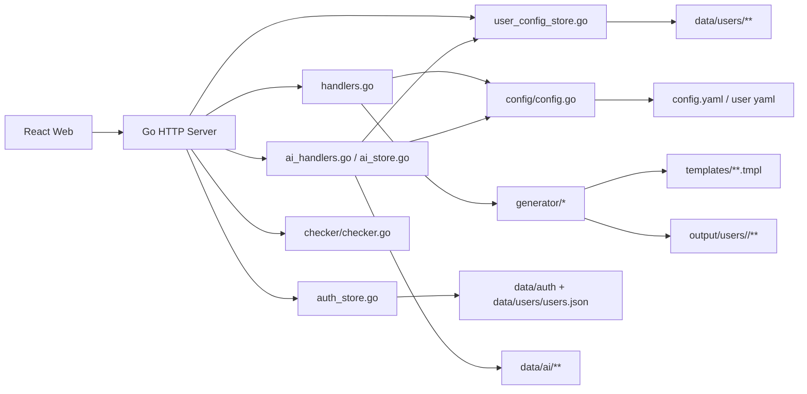
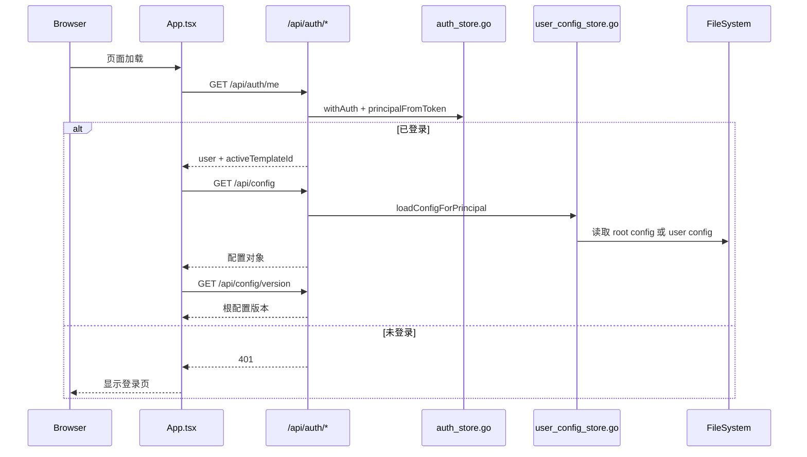
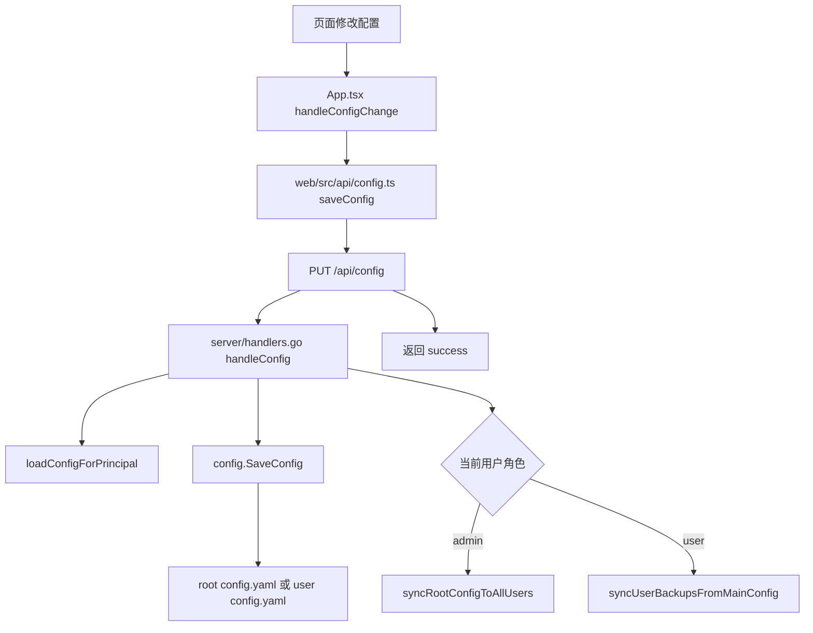
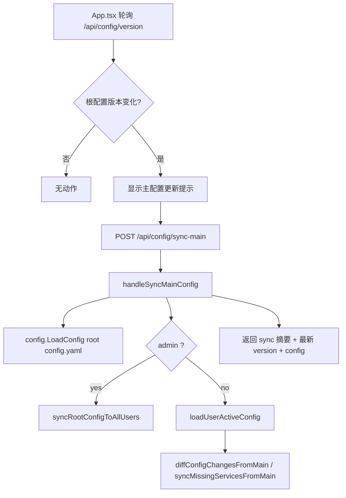
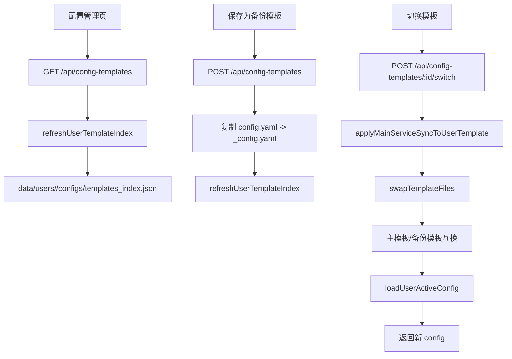
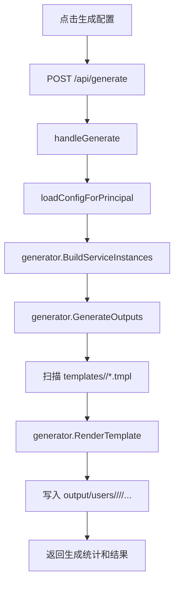
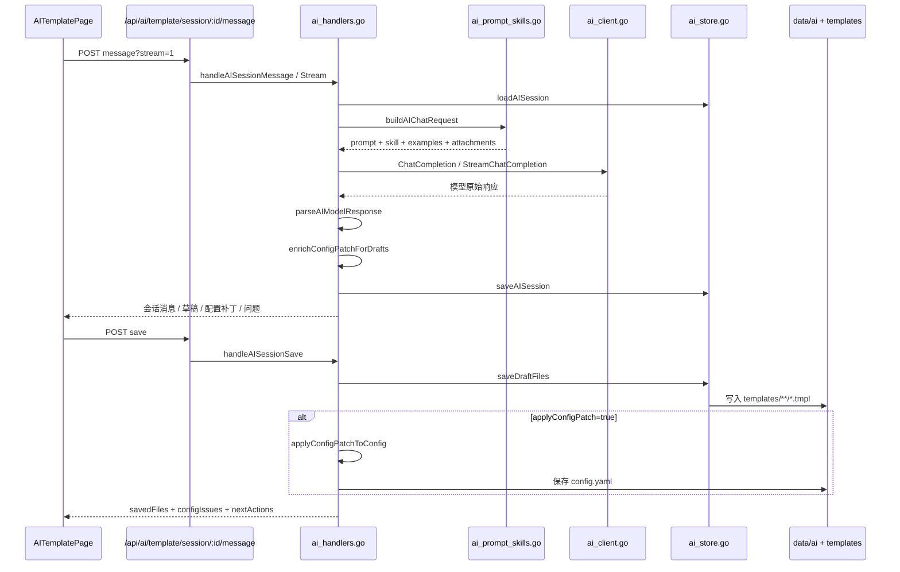
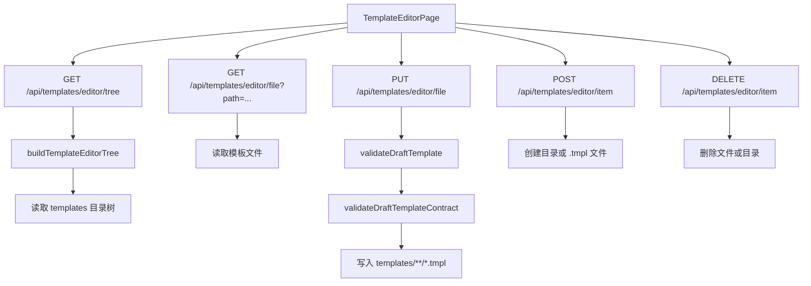
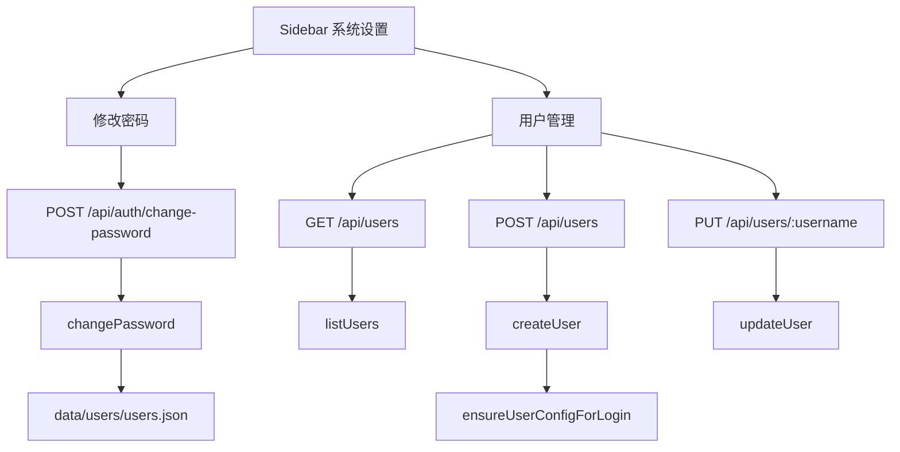
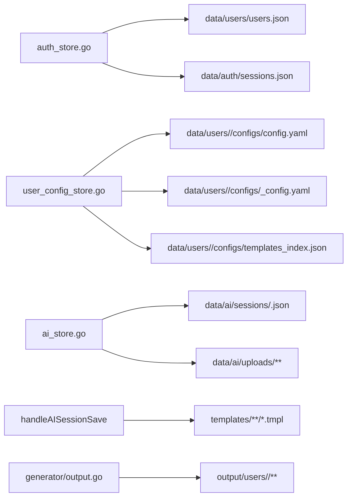

# 调用链图

本文档描述当前代码中的核心调用链，不是理想架构图。

## 1. 系统总览



## 2. 登录与初始化链路



## 3. 配置读写链路



## 4. 主配置增量同步链路



## 5. 配置模板管理链路



## 6. 生成输出链路



## 7. 模板渲染链路

```mermaid
flowchart LR
  A[Config] --> B[BuildServiceInstances]
  B --> C[ServiceInstance[]]
  C --> D[Context]
  D --> E[BuildTemplateFuncMap]
  E --> F[ParseTemplateContent / RenderTemplate]
  F --> G[输出文件]
```

## 8. AI 模板工作台链路



## 9. 模板编辑器链路



## 10. 系统设置与用户管理链路



## 11. 文件落盘链路


